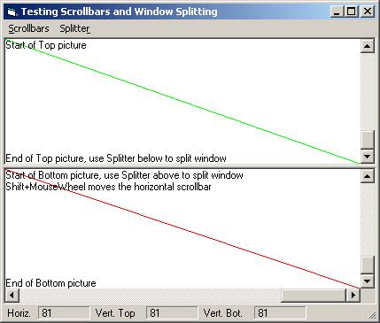



## UserControl: Split window, scrollbars with MouseWheel support

### Description

UserControl featuring window splitter, useful for editors, worksheets, tables and more. Exposes the work areas: use them in your client like you would use any other PictureBox. Full mouse support, including MouseWheel.
 
### More Info
 

             |
---                |---
**Submitted On**   |2005-12-01 08:02:24
**By**             |[Herbert Glarner](https://github.com/Planet-Source-Code/PSCIndex/blob/master/ByAuthor/herbert-glarner.md)
**Level**          |Intermediate
**User Rating**    |5.0 (15 globes from 3 users)
**Compatibility**  |VB 6\.0
**Category**       |[Custom Controls/ Forms/  Menus](https://github.com/Planet-Source-Code/PSCIndex/blob/master/ByCategory/custom-controls-forms-menus__1-4.md)
**World**          |[Visual Basic](https://github.com/Planet-Source-Code/PSCIndex/blob/master/ByWorld/visual-basic.md)
**Archive File**   |[UserContro1952811212005\.zip](https://github.com/Planet-Source-Code/herbert-glarner-usercontrol-split-window-scrollbars-with-mousewheel-support__1-63446/archive/master.zip)

